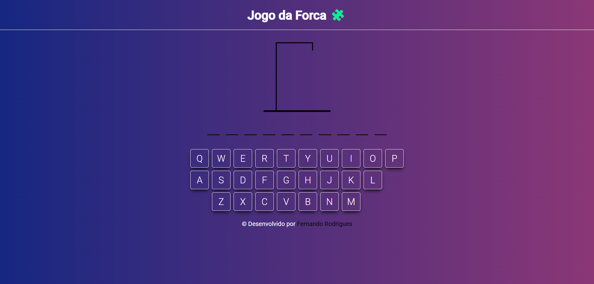
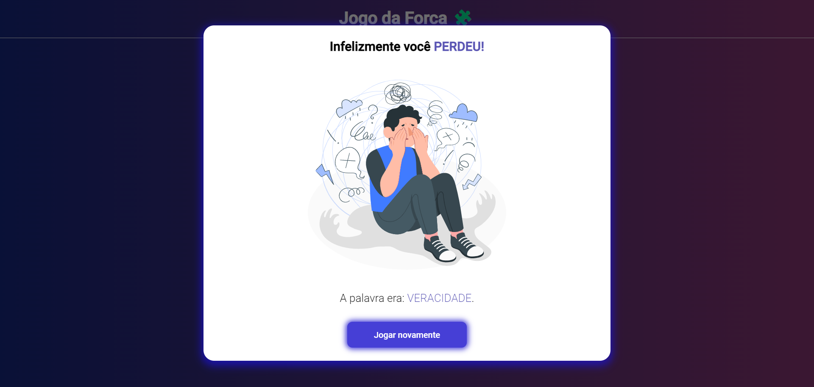
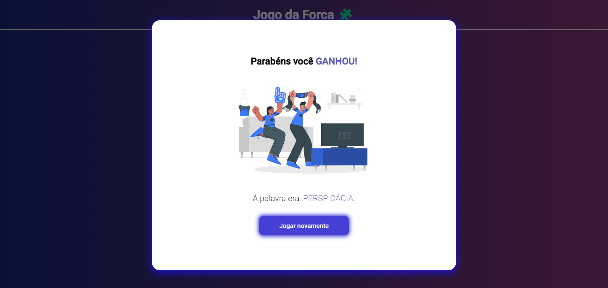

<h1 align="center">Hangman game</h1>

This is my hangman game, the second challenge of the project - ONE Oracle Next Education

  

   &
  

Summary
===========
<!--ts-->
  * [About](#about)
   * [Screenshot](#screenshot)
   * [How to use](#how to use)
   * [Status](#status)
   * [Features](#features)
   * [Technologies](#technologies)
   * [Author](#author)
<!--te-->

About
-----

This project is the second challenge of the ONE - Oracle Next Education project, a hangman game made with HTML, CSS and Javascript

I've always liked this game and it was really cool to be able to make my own, I'm very happy with the result. I found the site very beautiful and it met my expectations for the project.

At first I was looking for an API to get the words, but I didn't find any that worked for me. So I found a list with more than 2,000 words and I made an array.

O brilho do programa pra mim está no teclado, construí-lo foi relativamente simples e ficou muito intuitivo e bonito.

Screenshot
----------

How to use
---------

You can access the site by clicking<a href="https://fe7rodrigues.github.io/hangman_game/">aqui</a> ou abrindo o arquivo HTML em um navegador.

Right from the start a word will be drawn and you can try to find out which one it is, you have 6 attempts to get the word right.

At each end of the game, the correct word will be shown and you will be able to play again with another word drawn by clicking on the "Play again" button.

Status
------
Concluded
------
Functionalities
---------------
- [x] play with keyboard
- [x] play with the mouse
- [X] 6 attempts
- [X] More than 2,000 words
- [X] add words

Technologies
-----------

  
  
  

Author
------
<h3 align="center">Fernando Rodrigues</h3>

 
 <a href="https://github.com/fe7rodrigues"></img></a>
  <a href="https://www.linkedin.com/in/fe7rodrigues/"></img></a>

